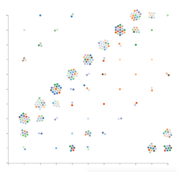

#  Beeswarm

Custom view that shows non-overlapping coloured points positioned along the x-axis and y-axis.

## Use case

The visualisation can be used to show the distribution of values in a dataset preserving the resolution of every data point rather than displaying aggregated (clustering, histogram) or overlapped (scatter) data.
This focuses on singularity and accumulation over accuracy.

## Settings

 - Chart
    - Split: Field to split/group markers by.
    - X: X coordinate of the marker.
    - Y: Y coordinate of the marker.

 - Marker
    - Colour (Optional): Categorical value to colour the markers by.
    - Tooltip (Optional): Tooltip text to show on the nodes when hovering.

### Libraries:
 - [d3.js](https://d3js.org/)
