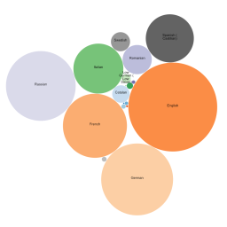

#  Bubble Chart

Custom view that shows aggregated data with coloured circles sized by a measure.

This visualization is particularly effective to show the proportion between elements through their areas.

The dataset consists of rows with an id value and a numerical value to size by.

### Libraries:
 - [d3.js](https://d3js.org/)