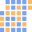
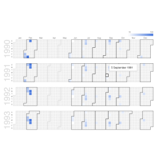

#  Calendar

Custom view that shows yearly calendars in a grid with cells coloured by a measure.

The visualisation aggregates all rows with the same date and marks the dates with data with lighter blue for lower values and darker blue for higher values. It will show all consecutive years in the dataset, adding any missing ones.

## Demo
[Public demo file](https://omniscope.me/Demos/Custom+Views/Github/calendar.iox/er/Report)

## Settings

 - Date: Date field to split/group the rows by.
 - Value (Optional): Numerical measure value to colour the dates by.

## Libraries
 - [Google Charts](https://developers.google.com/chart/interactive/docs/gallery/calendar)
