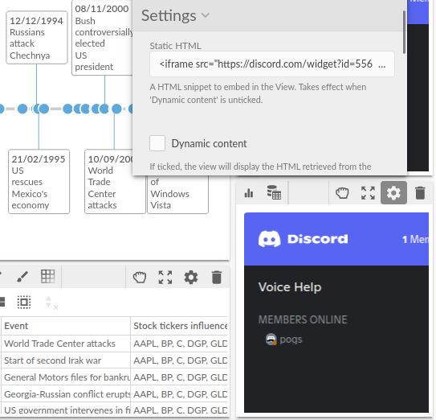

#  Custom HTML

Custom view that allows you to embed either a static HTML snippet, or to display dynamically HTML retrieved from the view input data.

You can use it to embed HTML widgets (e.g. a Discord channel widget) or to display HTML content dynamically based on the filtering / selection happening in other views.

