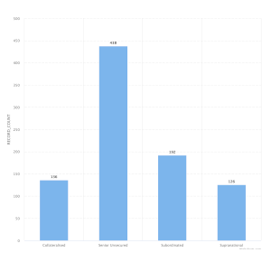

#  Custom View Demo

An example of creating a custom view that:

* Provides user-configurable split and measure options;
* Builds and executes a manual/advanced query;
* Renders a Highcharts bar chart;
* Supports selection of bars.

Use this as a starting point or for inspiration, if you wish to create your own custom view that uses some of these aspects.

## Settings

 - *Measure*: Measure value (determines the height of each bar). Internally `measures` for consistency with Omniscope core views.
 - *Split*: mandatory X axis grouping (determines each distinct bar). Internally `split`.
 - *Pane X* and *Pane Y*: optional paning (replicating the view in either/both axes, for different subsets of the data). Internally `paneX` and `paneY` as required for auto-paning. Note that this view specifies auto-paning in the manifest, rather than implementing paning itself. 

