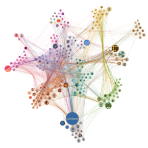

#  Force Coordinate Graph

Custom view that shows a force graph with bundled edges. The position of the nodes has to be determined in advance and be passed to the view. The layout then tries to find the best position avoiding overlapping.

## Use case

A typical use case would be the representation of clusters in a network. Pre-calculated coordinates based on the clusters and bundled edges allow a simplified view of a network.

## Settings

 - Chart
    - Node Id: Id of the origin node of the edge.
    - Linked node Id: Id of the target node of the edge.
    - X: X coordinate of the node
    - Y: Y coordinate of the node

 - Marker
    - Colour (Optional): Measure value to colour the nodes and edges by.
    - Size (Optional): Measure value to size the nodes by.
    - Tooltip (Optional): Tooltip text to show on the nodes when hovering.
    - Image URL (Optional): URL of the image shown in the nodes.
    
 - Edge
    - Weight (Optional): Measure value used to sort the edges and show the most important ones.

### Libraries:
 - [d3.js](https://d3js.org/)
 - [d3-ForceEdgeBundling.js](https://github.com/upphiminn/d3.ForceBundle)