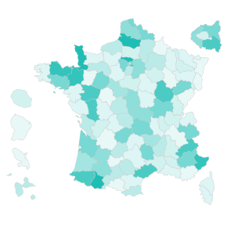

#  France Choropleth

Custom view that shows a choropleth map of France divided by 100 departments. Each deparment can be coloured by a measure.

A detailed tutorial on how to create a choropleth map can be found [here](https://help.visokio.com/support/solutions/articles/42000012405-how-to-create-a-custom-view-choropleth-map-example-using-d3). 

The dataset consists of rows with an id value that matches the department name and a numerical value to colour by.

### Libraries:
 - [d3.js](https://d3js.org/)