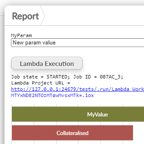

#  Lambda Workflow Execution

Lambda data workflow execution custom View through Workflow API.

A "lambda execution" allows you to trigger a parametrised atomic workflow execution, where Omniscope generates a new instance of a project, edits the project parameters and triggers an isolated execution, 
optionally deleting the instantiated per-request project and cached execution data when the job execution is over.

The view allows you to specify a list of blocks to execute and a list project parameters to set upon execution.
It shows a simple HTML button to start the workflow job and optionally shows the status of the job.

[Workflow Execution REST API](https://help.visokio.com/support/solutions/articles/42000073133-workflow-execution-rest-apis). 

## Settings

 - Blocks : the list of block names, comma separated, to execute.
 - Param names : the list of parameter names to display and set.

