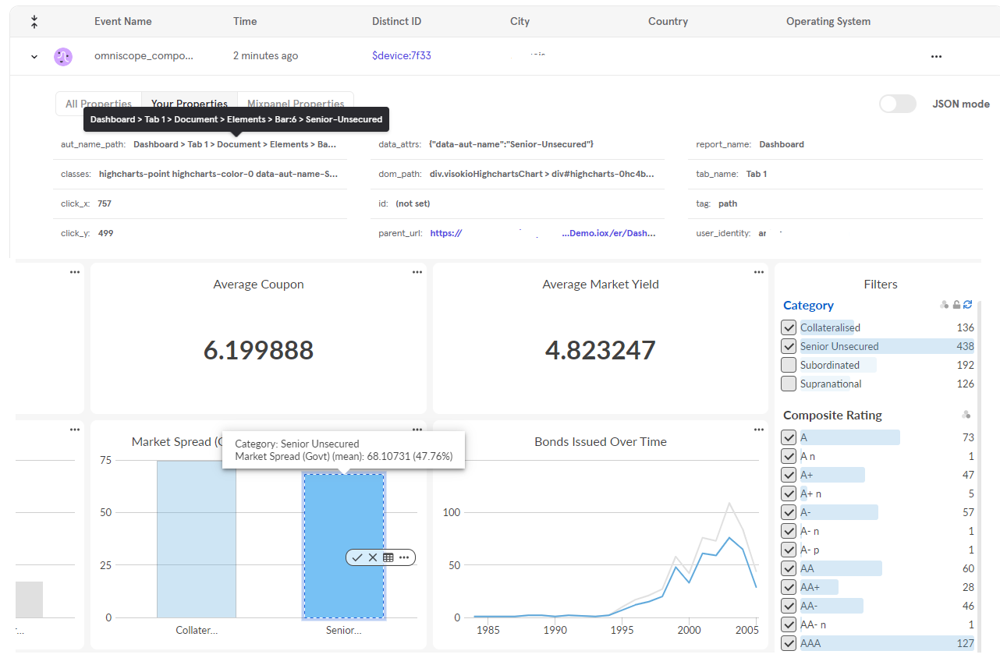

A Omniscope Custom View that embeds Mixpanel analytics and automatically tracks all user interactions across the entire report, including clicks on charts, filters, and UI components.  
It captures hierarchical paths, element metadata, Omniscope report/tab context, and user identity, providing full visibility of how users navigate and interact with your dashboards.

