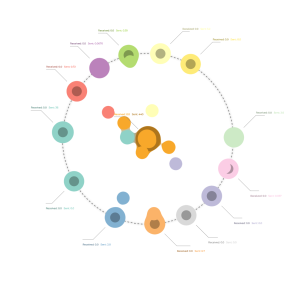

#  Orbital transaction flow

Custom view that shows live transactions between entities. The view will show fixed circles for all entities referenced in the transactions as sources or targets. These circles will have inner and outer areas that match the accumulated transaction values received and sent respectively. All new transactions will be shown as circles moving from one entity to another and sized by its value. During the animation, the entities will update their annotation and size.

The input data consists of individual transactions with a timestamp.
The view will aggregate all transactions that have the same origin and target and happen during the same one minute period.

## Use case

A typical use case would be the representation of live transactions between multiple entities.
An example IOZ file using the Token Analyst API can be [downloaded](TokenAnalystDemo.ioz).

## Settings

 - Chart
    - Centre Node Id: Id of the node shown at the centre of the view.

 - Transaction
    - Id: Unique identifier of the transaction.
    - Source: Identifier of the source sending the transaction.
    - Target: Identifier of the target where the transaction is sent to.
    - Date: Date of the transaction. Transactions with the same source and target that happen in the same minute will be shown as one.
    - Value: Value to size the transaction circles by.

### Libraries:
 - [d3.js](https://d3js.org/)
 - [d3-annotation](https://d3-annotation.susielu.com/)
