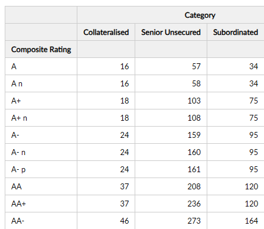

#  Running Pivot View

This view displays a multi‐level pivot table with paneY fields as row columns and paneX fields as hierarchical column headers, calculating and showing a running total of the selected measure down each column.

