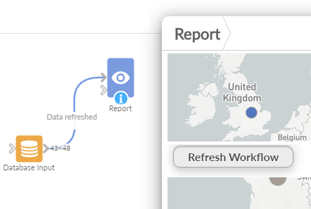

#  Sequential Workflow Execution

Custom view that shows a button to trigger a data Workflow execution of specified blocks in order.

This view executes a series of workflow blocks in a strictly sequential manner by initiating multiple workflow execution calls one after the other, ensuring that the order is preserved and each step completes successfully before moving on, with the process halting immediately if any block fails.

It's a simple wrapper around the [Workflow Execution REST API](https://help.visokio.com/support/solutions/articles/42000073133-workflow-execution-rest-apis). 

## Settings

 - Blocks : the list of block names, comma separated, to execute in order.

