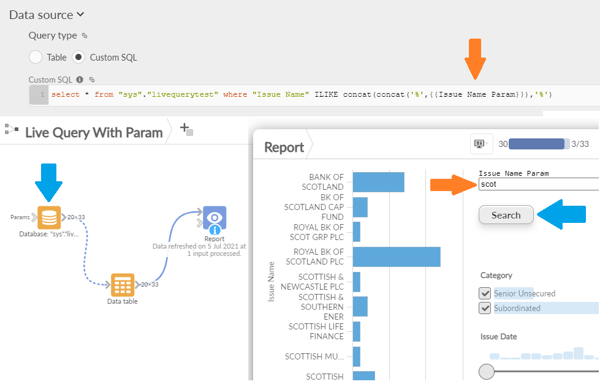

#  Set Parameters and Execute

Custom view that allows you to set server/project parameters and trigger a data Workflow execution of specified blocks in one request.

The view allows you to set the text value of all or some parameters and to insert a list of blocks to execute. 
It shows a simple HTML button (with customisable text) to set the params and to start the workflow job, optionally showing the status of the job.

It's a simple wrapper around the [Workflow Execution REST API](https://help.visokio.com/support/solutions/articles/42000073133-workflow-execution-rest-apis). 

## Settings

 - Blocks : the list of block names, comma separated, to execute.
 - Parameters : the list of parameter names, comma separated, to set. (empty to show all params).

