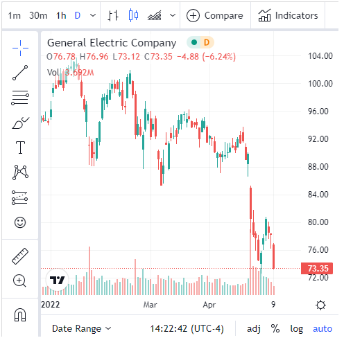

#  TradingView

Embed a TradingView widget to display real-time financial quotes of stocks, crypto and other assets, with advanced tools for technical analysis.

## Settings

 - Ticker : a field (+ optional function) in your dataset that contains the ticker name (e.g. AAPL) of the asset to display

