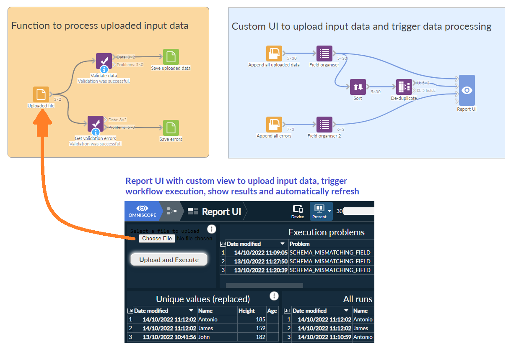

#  Upload and Execute

Custom view that allows you to upload a source file as input data and trigger a data Workflow execution of specified blocks in one request, optionally refreshing the report where this view is on.

The view allows you to select a file, typically a csv, json, txt, IOD, to upload to Omniscope Evo so that a File block can be configured with such uploaded file,
to then trigger a workflow execution of some specified blocks.
It shows a simple HTML button to select a file and a button to upload and execute the workflow.

It's a simple wrapper around the [Workflow Execution REST API](https://help.visokio.com/support/solutions/articles/42000073133-workflow-execution-rest-apis). 

## Requirement
It requires a project param to be called `uploadedFile` to be linked to the File block path option.

### Example project
[Download IOZ project](WorkflowAndUI.ioz)

