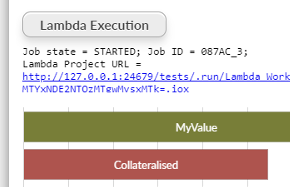

#  Lambda Workflow Execution using Variables

Lambda data workflow execution custom View through Workflow API using Report variables.

A "lambda execution" allows you to trigger a parametrised atomic workflow execution, where Omniscope generates a new instance of a project, edits the project parameters and triggers an isolated execution, 
optionally deleting the instantiated per-request project and cached execution data when the job execution is over.

The view assumes your Project parameters have the same name as the variables, and then when you execute using the 
simple HTML button to start the execution it will automatically set all matching variables and parameter names with the 
value of the variable and trigger execution.

[Workflow Execution REST API](https://help.visokio.com/support/solutions/articles/42000073133-workflow-execution-rest-apis). 

## Settings

 - Blocks : the list of block names, comma separated, to execute.

